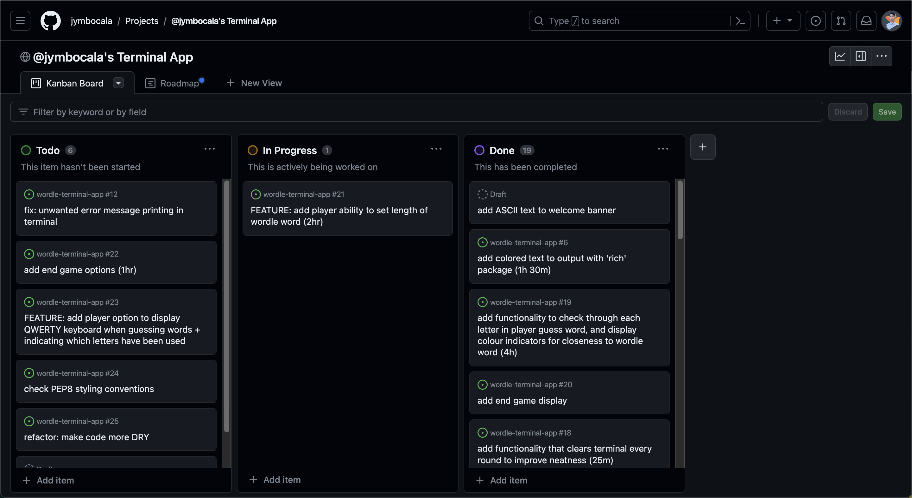

# Wordle Terminal App

Welcome to Wordle Terminal App, a text-based recreation of the popular word-guessing puzzle game. Emulating the spirit of the real [Wordle](https://www.nytimes.com/games/wordle/index.html) game, this terminal-based version challenges players to decipher a hidden five-letter word through a series of educated guesses. Try your linguistic prowess and immerse yourself in the world of word puzzles with Wordle Terminal App.

******

## Features

### 1. Keyboard Display

This feature provides a visual representation of the keyboard layout that helps the player keep track of their guessed letters. The keyboard display makes it easier to manage guesses by showing which letters have already been used and which ones are still available.

<u>Toggle Keyboard:</u> The player can control the visibility of the keyboard display by navigating to the "Options" menu within the game. From there, they can toggle the keyboard on or off, allowing them to customize their gaming experience based on their preferences.

### 2. Customizable Word Length

In the Wordle Terminal App, players have the flexibility to customize the length of the secret Wordle word, allowing them to tailor the game's difficulty to their preferences. By default, Wordle presents players with 5-letter words, mirroring the classic Wordle experience. However, players can choose to increase the challenge by opting for longer words or make it more accessible by selecting shorter ones.

<u>How to Set Word Length:</u> 

- Navigate to the "Options" menu by typing "o" in the Welcome screen or End Game screen.
- Enter the command "length" followed by the desired number. For example, typing "length4" sets the word length to 4, while "length6" increases it to 6. The minimum word length allowed is 3, and the maximum is 7.

### 3. Post-Win Game Options

In Wordle Terminal App, the excitement doesn't end when the player successfully guesses the secret word. After a triumphant victory, players have the opportunity to make choices for what comes next. They can decide their next step: press "s" to start a new round, "o" to modify settings and game difficulty, or "x" to gracefully end the game. This feature adds replayability and control to the Wordle experience.

<u>Start a New Round (S):</u> If players are eager to dive back into the game and challenge themselves with another word, they can simply press "s" to begin a fresh round of Wordle. They'll receive a new secret word to decipher, and the fun continues.

<u>Modify Game Settings (O):</u> Wordle offers a menu of customizable options. By pressing "o," players can access the "Options" menu, where they have the freedom to tweak game settings, such as adjusting the word length and toggling the keyboard display for added difficulty.

<u>End the Game (X):</u> If it's time to take a break or conclude the Wordle session, players can press "x" to exit the game.

## Code Style Guide

This project follows the Python Enhancement Proposal 8 (PEP8) style guide to ensure clean and consistent code formatting. PEP8 is the de facto standard for Python code style, and it helps maintain code readability and consistency across Python projects. You can find the full PEP8 style guide [here](https://peps.python.org/pep-0008/).

Here's an example of PEP8-compliant code style in Wrodle Terminal App:

```
class GameSession():  # Manages the game state and logic
    def __init__(self, wordle_word):
        self.wordle_word = wordle_word
        # Initialize an empty list to store guessed words
        self.guessed_words = []
        self.attempts_left = 6  # Max number of attempts
```

This code snippet demonstrates several PEP8-compliant practices, including:
✅ Indentation: Each level of indentation is four spaces.
✅ Line Length: Lines are kept within a reasonable length to ensure readability.
✅ Spacing: Proper spacing is used around operators and within comments for clarity.

******

## Software and Hardware Requirements

### Software Requirements

- **Operating System**: Wordle is designed to run on various operating systems, including Windows, macOS, and Linux.

- **Python 3 or Higher**: Wordle is built using Python, so make sure you have Python 3 or a higher version installed on your system. You can check your Python version by running `python3 --version`. If you don't have Python installed, you can download it from the [official Python website](https://www.python.org/downloads/).

- **pip (Python Package Manager)**: Ensure that pip is available in your Python installation. pip is a package manager for Python and is usually included with Python. You can check if pip is installed by running `pip --version`.

### Hardware Requirements

- **CPU**: Wordle is a text-based game and does not require significant CPU resources. Any modern computer or laptop should be sufficient.

- **Memory (RAM)**: A minimum of 2GB of RAM is recommended to run Wordle smoothly.

- **Disk Space**: Wordle has minimal disk space requirements. You'll need less than 100MB of free storage space to download and install the game.

- **Display**: Wordle's text-based interface is compatible with various screen sizes and resolutions.

- **Input**: You'll need a standard keyboard for typing your guesses during the game.

- **Internet Connection**: An internet connection is required for downloading Wordle and its dependencies. Once downloaded, the game can be played offline.

Please note that the specific requirements may vary based on your operating system and the configurations of your computer.

******

## Installation and Gameplay
1. **Check Python Install Status**: Wordle requires Python 3 or higher to run.

    To check if Python is installed and verify its current version, open a new terminal window and enter the following command:
    ```bash
    python3 --version
    ```
    This should return a message with the Python version, such as:
    ```
    Python 3.10.1
    ```
    If Python is not installed or the version is lower than 3.0, please visit the official [Python download page](https://www.python.org/downloads/) for installation instructions.

2. **Download and Install Wordle**: 
    - Visit the [Wordle Terminal App GitHub Repository](https://github.com/jymbocala/wordle-terminal-app).
    - In the repository, click on the "Code" tab, and select "Download ZIP" to download the Wordle files.

        

3. **Play Wordle**: 
    Open a new terminal window and navigate to the directory where you've placed the Wordle repository. The navigation command may look like this:
    ```bash
    cd path/to/wordle
    ```
    From within the `wordle` directory, execute the Wordle script by running the following command:
    ```bash
    bash wordle_script.sh
    ```
    This script will activate a virtual environment, install the required dependencies, and run the game in Python.

    *Note: If you encounter permissions errors, you may need to allow execution. Run the following commands from the `src` directory in the terminal window:
    ```bash
    chmod +x ./wordle_script.sh
    ```

4. **Playing Wordle**: 
    - To play Wordle, guess the secret five-letter word.
    - After each guess, you'll receive feedback using color indicators:
      - Green: Correct letter in the right position.
      - Orange: Correct letter in the wrong position.
      - Grey: Incorrect letter.
    - Try to guess the word within six attempts to win!

Have fun playing Wordle!

******

##  Implementation Plan
For the development of this Wordle project, I used the GitHub Projects. This tool allowed me to do the following::

Task Prioritization: GitHub Projects helped prioritize tasks, ensuring that critical elements received immediate attention.

Structured To-Do Lists: I organized project boards with detailed task cards, creating comprehensive to-do lists.

Progress Tracking: By regularly updating task cards with comments and status changes, I effectively monitored progress, ensuring transparency in what was completed and what remained.

**Features TODO Lists** 


**An error task** 


**Oct 24 Kanban** 


**Oct 26 Kanban** 


**Oct 27 Kanban** 


******

## Required Dependencies:
```
astroid==3.0.1
beautifulsoup4==4.12.2
bs4==0.0.1
certifi==2023.7.22
charset-normalizer==3.3.0
click==8.1.7
dill==0.3.7
futures==3.0.5
goslate==1.5.4
idna==3.4
isort==5.12.0
markdown-it-py==3.0.0
mccabe==0.7.0
mdurl==0.1.2
pep8==1.7.1
platformdirs==3.11.0
pycodestyle==2.11.1
PyDictionary==2.0.1
Pygments==2.16.1
pylint==3.0.2
requests==2.31.0
rich==13.6.0
soupsieve==2.5
tomlkit==0.12.1
urllib3==2.0.7
wonderwords==2.2.0
```

******

## References:
Download python (2023) Python.org. Available at: https://www.python.org/downloads/ (Accessed: 23 October 2023). 
Geekpradd (2021) Error: The following error occured: List index out of Range · issue #35 · geekpradd/Pydictionary, GitHub. Available at: https://github.com/geekpradd/PyDictionary/issues/35 (Accessed: 29 October 2023). 
March, J. (2023) Enthought python minimum hardware requirements, Enthought. Available at: https://support.enthought.com/hc/en-us/articles/204273874-Enthought-Python-Minimum-Hardware-Requirements (Accessed: 28 October 2023). 
McGugan, W. (2023) Rich, PyPI. Available at: https://pypi.org/project/rich/ (Accessed: 29 October 2023). 
Nyingi, J. (2019) Setting up pep8 and Pylint on vs code, DEV Community. Available at: https://dev.to/j0nimost/setting-up-pep8-and-pylint-on-vs-code-34h (Accessed: 29 October 2023). 
Py-dictionary (2021) PyPI. Available at: https://pypi.org/project/Py-Dictionary/ (Accessed: 25 October 2023). 
Real Python (2023) How to write beautiful python code with PEP 8, Real Python. Available at: https://realpython.com/python-pep8/#maximum-line-length-and-line-breaking (Accessed: 29 October 2023). 
Rebguns, M. (2021) Wonderwords, PyPI. Available at: https://pypi.org/project/wonderwords/ (Accessed: 25 October 2023). 
Rocholl, J.C. (2023) Pycodestyle, PyPI. Available at: https://pypi.org/project/pycodestyle/ (Accessed: 24 October 2023). 
van Rossum, G., Warsaw, B. and Coghlan, A. (2023) Python enhancement proposals, PEP 8 – Style Guide for Python Code. Available at: https://peps.python.org/pep-0008/ (Accessed: 29 October 2023). 
Wordle - a daily word game (no date) The New York Times. Available at: https://www.nytimes.com/games/wordle/index.html (Accessed: 29 October 2023). 